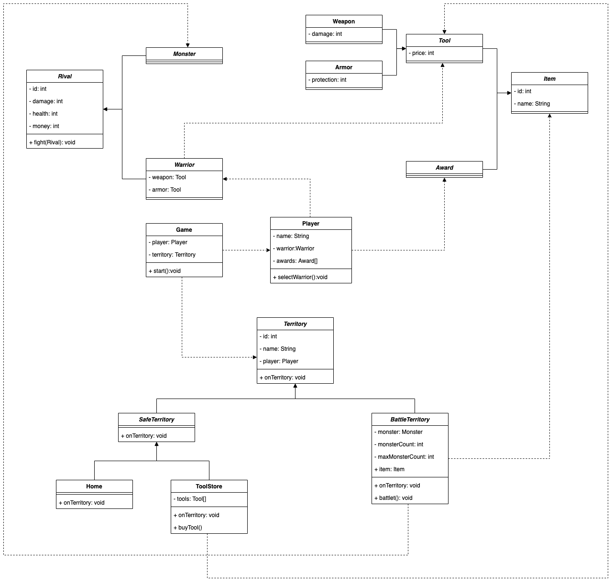

# Adventure Game

Text based adventure game developed with Java.

## Requirements

- If the player can collect all the prizes and return to the "Safe Home", they win the game.

- After all enemies in the battle zones are cleared, the zone-specific reward must be added to the player's inventory.

- It is not possible to re-enter the region where the award was won.

- When the player and the monster will fight, it should be determined with 50% probability who will make the first move.

- The probability of gaining money, weapons and armor from monsters defeated in the mining area should be as in the table below.

    | **Rate (%)** | **Weapon (15%)** | **Armor (15%)** | **Money (25%)** | **No Award (45%)** |
    |:------------:|:----------------:|:---------------:|:---------------:|:------------------:|
    |    **50**    |        Gun       |      Light      |      1 unit     |          -         |
    |    **30**    |       Sword      |      Medium     |     5 units     |          -         |
    |    **20**    |       Rifle      |      Heavy      |     10 units    |          -         |

## Game Elements

### Warriors

|     Name    | Id | Damage | Health | Money |
|:------------|:--:|:------:|:------:|:-----:|
| **Samurai** |  1 |    5   |   21   |   15  |
| **Archer**  |  2 |    7   |   18   |   20  |
| **Knight**  |  3 |    8   |   24   |   5   |

### Monsters

|     Name    | Id | Damage | Health | Money |
|:------------|:--:|:------:|:------:|:-----:|
| **Zombie**  |  1 |    3   |   10   |   4   |
| **Vampire** |  2 |    4   |   14   |   7   |
| **Bear**    |  3 |    7   |   20   |   12  |
| **Snake**   |  4 |   3-6  |   12   |   -  |

### Weapons

|    Name   | Id | Damage | Price |
|:----------|:--:|:------:|:-----:|
| **Gun**   |  1 |    2   |   25  |
| **Sword** |  2 |    3   |   35  |
| **Rifle** |  3 |    7   |   45  |

### Armors

| Name       | Id | Protection  | Price |
|------------|:--:|:-----------:|:-----:|
| **Light**  |  1 |      1      |   15  |
| **Medium** |  2 |      3      |   25  |
| **Heavy**  |  3 |      5      |   40  |

### Territories

|      Name      |  Id | Feature          | Monster             | Award              | Weapon            | Armor                 |
|:---------------|:---:|:----------------:|:-------------------:|:------------------:|:-----------------:|:---------------------:|
| **Safe House** |  1  | Health           | -                   | -                  | -                 | -                     |
| **Cave**       |  2  | Combat + Item    | Zombie - Count:1-3  | Food               | -                 | -                     |
| **Forest**     |  3  | Combat + Item    | Vampire - Count:1-3 | Firewood           | -                 | -                     |
| **River**      |  4  | Combar + Item    | Bear - Count: 1-3   | Water              | -                 | -                     |
| **Tool Store** |  5  | Item             | -                   | -                  | Gun, Sword, Rifle | Light, Medium, Heavy  |
| **Mine**       |  6  | Item             | Snake - Count: 1-5  | Money-Weapon-Armor | -                 | -                     |

## UML Diagram

